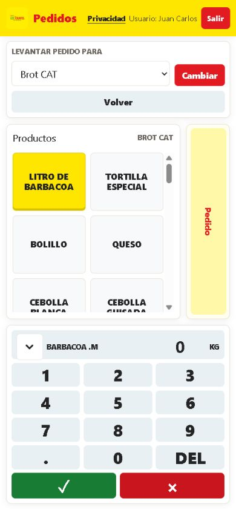
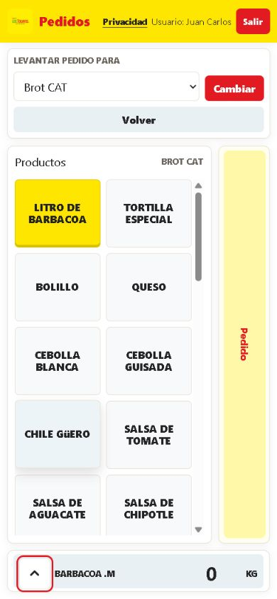
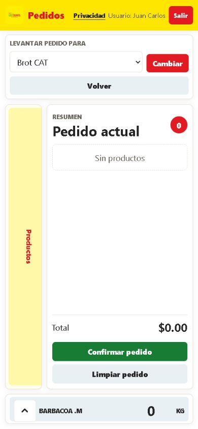
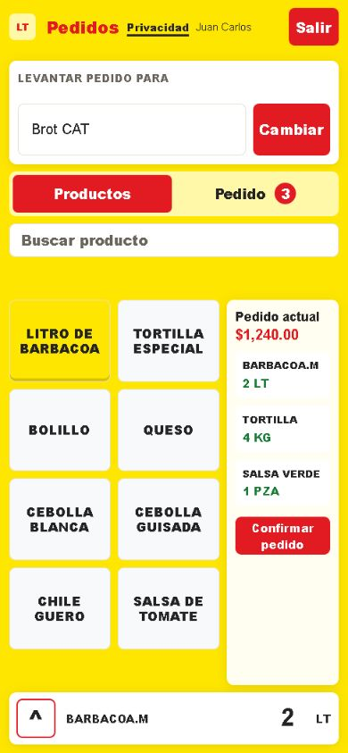

# Mocks UX/UI - Pedido móvil con teclado colapsable

Fuente de criterio: `$impeccable adapt` + `$impeccable audit` sobre la pantalla
`pedidos/templates/pedidos/pedidos.html`.

## Hallazgos UX

- La pantalla de pedido es una superficie de operación: el usuario necesita capturar rápido, revisar el resumen y confirmar sin perder contexto.
- En móvil, el teclado ocupa una franja fija grande. Cuando aparece un aviso adicional, el resumen del pedido pierde altura útil y se vuelve difícil de inspeccionar.
- La advertencia de horario compite con la tarea principal. La validación debe permanecer en backend y en el flujo de confirmación, pero no como banner persistente dentro del pedido.
- El control de plegado debe vivir junto al teclado, con objetivo táctil mínimo de 44px y estado accesible (`aria-expanded`).

## Mock A - Teclado expandido

Estado inicial o al seleccionar un producto.

Notas:
- La flecha hacia abajo comunica que el teclado puede bajar a barra.
- Producto, cantidad y unidad se conservan visibles para mantener orientación.
- Seleccionar un producto o un item del pedido restaura este estado.

## Mock B - Barra inferior plegada

Estado al tocar la flecha del teclado.

Notas:
- La barra libera altura para inspeccionar el pedido.
- La flecha hacia arriba comunica que el teclado puede volver a desplegarse.
- No hay banner horario persistente en esta superficie.

## Mock C - Pedido abierto con teclado plegado

Estado enfocado en inspeccionar el pedido.

Notas:
- En 390x844, el panel de pedido queda cerca de 288x560px con el teclado plegado.
- El cuerpo de la pagina no necesita scroll; el scroll queda dentro de las listas.
- El usuario conserva el producto/cantidad activos en la barra inferior.

## Mock D - Siguiente etapa UI

Propuesta para una futura pasada visual, sin implementarla todavía.

Notas:
- Reemplazar las pestañas verticales por una cabecera compacta con conteo puede
  reducir carga cognitiva.
- El resumen puede abrirse como panel principal temporal en móvil, manteniendo la
  barra de teclado abajo.
- Los botones destructivos deberían usar iconografía consistente en una siguiente
  etapa, no glifos sueltos.

## Deuda UI detectada

El detector mecánico de Impeccable corrió en modo degradado porque faltan módulos
opcionales de parser (`htmlparser2`, `css-select`, `css-tree`, `domutils`). Sus
hallazgos son un subconteo, no una garantía completa.

- `static/css/styles.css`: la familia global `Inter, Roboto, Segoe UI, Arial`
  aparece como fuente sobreusada. Conviene definir una voz tipográfica propia en
  una etapa visual completa.
- `static/css/styles.css`: hay bordes de acento gruesos en login/admin que el
  detector marca como patrón visual genérico. No afectan esta pantalla de captura,
  pero deberían revisarse cuando se haga el polish del sistema.
- Pantalla de pedido: el cambio aplicado elimina el banner horario persistente y
  agrega una barra de teclado plegable con objetivo táctil de 44px.
